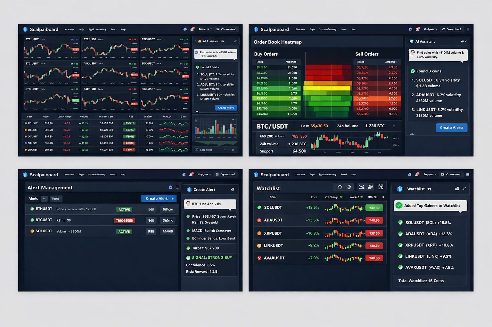

# 🎨 Scalpaiboard UI Design Overview

> **Scalpaiboard** is a professional, AI-powered cryptocurrency intelligence platform.
> The UI is designed for **speed, clarity, and decision-making under pressure**, combining real-time data visualization with an embedded AI trading assistant.

This document describes the **visual design, layout philosophy, and functional intent** of the Scalpaiboard interface as presented in the current UI mockups.

---

## 1. Global Design Language

### Theme

* **Dark-first UI** optimized for traders (low eye strain, high contrast)
* Color palette:

  * Background: Deep navy / charcoal
  * Primary: Blue (brand identity, actions)
  * Positive: Green (bullish, buy pressure)
  * Negative: Red (bearish, sell pressure)
  * Neutral: Gray (labels, secondary data)

### Typography

* Sans-serif, modern trading-style fonts
* Clear hierarchy:

  * Large numeric emphasis for price & % change
  * Compact labels for indicators
  * Chat-style typography for AI assistant

### Visual Goals

* Zero visual clutter
* At-a-glance decision support
* Clear separation between **data**, **analysis**, and **actions**

---

## 2. Main Dashboard – Multi-Chart Screener View

### Layout

* Grid-based layout showing **multiple charts simultaneously**
* Typically **8–12 trading pairs** visible at once
* Each chart card contains:

  * Candlestick chart
  * Color-coded trend direction
  * Symbol and timeframe label
  * Small badges for momentum / trend

### Purpose

* High-level market scanning
* Rapid comparison across assets
* Momentum detection without context switching

### Design Details

* Green candles = bullish movement
* Red candles = bearish movement
* Minimal axes to reduce noise
* Subtle gridlines to preserve focus on price action

---

## 3. Screener Table (Lower Section)

### Table Structure

A dense but readable table containing:

* Coin / Pair
* Current Price
* 24h % Change
* Volume
* Market Cap
* Technical indicators (RSI, MACD, momentum)

### Visual Encoding

* Positive values highlighted in green
* Negative values highlighted in red
* Indicators shown as compact micro-charts
* Status pills (e.g. **TREND**, **RSI LOW**, **MACD UP**)

### Purpose

* Precision filtering
* Sorting by opportunity
* Transition from macro (charts) → micro (numbers)

---

## 4. AI Assistant Sidebar

### Placement

* Fixed **right-side panel**
* Always visible
* Occupies ~25–30% of horizontal space

### Chat Design

* Conversational UI (similar to Slack / ChatGPT)
* Clear separation between:

  * User prompts
  * AI responses
  * Action confirmations

### AI Capabilities Shown

* Market scanning (e.g. “Find coins with >$100M volume”)
* Volatility detection
* Ranked results with explanations
* Action buttons:

  * **Create Alert**
  * **Add to Watchlist**

### Design Intent

* Acts as a **copilot**, not a chatbot
* Responses are structured, concise, and actionable
* AI output visually feels “trusted” and system-native

---

## 5. Order Book Heatmap View

### Structure

* Central heatmap split vertically:

  * **Left (Green)** → Buy orders
  * **Right (Red)** → Sell orders

### Data Encoding

* Color intensity = order size / liquidity
* Price levels stacked vertically
* Strong liquidity zones immediately visible

### Supporting Data

* Current price
* 24h volume
* Support / resistance markers
* Mini candlestick chart beneath heatmap

### Purpose

* Detect hidden liquidity
* Identify support & resistance walls
* Visualize market pressure in real time

---

## 6. Alert Management Panel

### Layout

* List-based alert manager
* Each alert row includes:

  * Coin symbol
  * Trigger condition
  * Status (ACTIVE / TRIGGERED)
  * Quick actions (Edit / Disable)

### Status Indicators

* Green = Active
* Red = Triggered
* Clear visual differentiation

### AI Integration

* Adjacent AI explanation panel:

  * Why alert exists
  * Technical context
  * Confidence score
  * Risk/Reward estimate

### Purpose

* Central control for automation
* Minimal friction for alert creation & maintenance

---

## 7. Watchlist View

### Structure

* Clean list of tracked assets
* Each row includes:

  * Coin symbol
  * % change
  * Mini sparkline
  * Current price

### AI Feedback Panel

* Confirmation messages like:

  * “Added Top Gainers to Watchlist”
* Summary of changes
* Reinforces user intent

### Design Intent

* Watchlist as a **living workspace**
* Tight loop between AI → action → confirmation

---

## 8. UX Philosophy

### Core Principles

1. **Speed over decoration**
2. **Signal over noise**
3. **AI as augmentation, not replacement**
4. **Minimal clicks to action**
5. **Everything real-time**

### Target User

* Active traders
* Scalpers / intraday traders
* Technical analysts
* Power users who value information density

---

## 9. Brand Impression

The UI communicates:

* Professional
* Trustworthy
* High-performance
* “Trading desk” quality rather than retail gimmicks

Scalpaiboard visually positions itself closer to:

* Bloomberg / TradingView Pro
  than
* Retail crypto dashboards

---

## 10. Summary

The Scalpaiboard UI successfully combines:

* **Real-time market visualization**
* **Advanced technical data**
* **Embedded AI intelligence**
* **Action-first design**

It is built to support **fast, informed decisions** with minimal cognitive overhead, making it suitable for both professional and advanced retail trading workflows.

---
